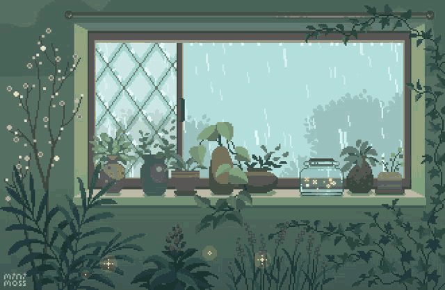

  

Olá, prazer! Me chamo Gustavo Portela. 

Desde o início da minha carreira, tenho me dedicado a aprimorar minhas habilidades como Desenvolvedor Web, investindo de forma contínua em diversos cursos para expandir meus conhecimentos de maneira incessante.

Com esse propósito, estou cursando Programação Web em Java no Senac, juntamente com o Instituto Proa. Também estou cursando Sistemas de Informação, além disso, realizei três semestres de Análise e Desenvolvimento de Sistemas e planejo retomar e concluir esse curso em um futuro próximo. 

No momento, estou aprofundando meus estudos em React e MySQL. Além de possuir habilidades sólidas em HTML5, CSS3, e JavaScript. Me esforço constatemente para melhorar o meu entendimento em algoritmos e lógica de programação.

O aprendizado autodidata em Design Gráfico me proporcionou o domínio de ferramentas essenciais como Canva, Adobe Photoshop, Illustrator, After Effects, Media Encoder e Premiere Pro. Para complementar, possuo proficiência em inglês nível B2, certificado pelo exame FCE da Cambridge English.

Sou uma pessoa empática, lógica, criativa e proativa, sempre aberto a novas oportunidades. Estou à disposição para conversarmos ou para que possamos nos conectar melhor, sinta-se à vontade para me contatar pelo chat

###
<h2><h2>

  
  

###

<h3>Minhas tecnologias ⋆.˚</h3>
  
  
  
  
  
  
  
  
  
  
  
  
  

###

<h3>Se conecte comigo  ⋆.˚</h3>

###

  
  
  
   
  
  
  

   
  
  
  

###

<picture align="center">
  <source media="(prefers-color-scheme: dark)" srcset="https://raw.githubusercontent.com/portelagu/portelagu/output/github-contribution-grid-snake-dark.svg">
  <source media="(prefers-color-scheme: light)" srcset="https://raw.githubusercontent.com/portelagu/portelagu/output/github-contribution-grid-snake-dark.svg">
  
</picture>
